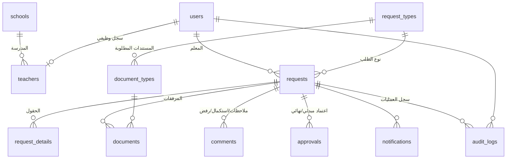
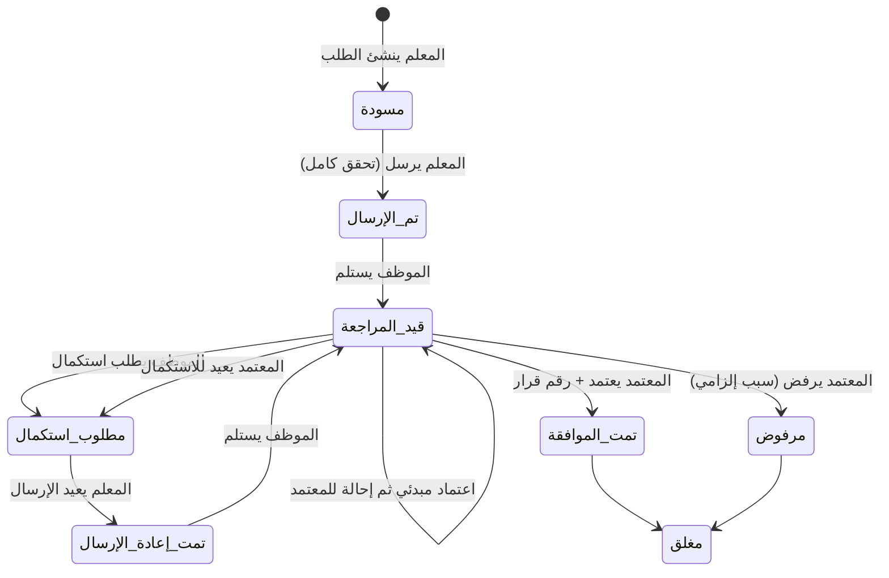

# نظام إدارة طلبات التفرغ الجزئي للمعلمين

نظام ويب عربي (RTL) يدير دورة حياة طلب التفرغ الجزئي كاملة:
**تقديم ← رفع المستندات ← التحقق من الاكتمال ← مراجعة الموظف ← طلب الاستكمال ← الإحالة ← الاعتماد ← إصدار القرار ← الأرشفة ← التقارير.**

بُني على استمارات عملية التأهيل المرفقة (استمارة بيانات الطالب، استمارة الأوضاع الدراسية، عقد الالتحاق، استمارة تفويض دارس)، وصُمم ليتوسع لاحقًا إلى **منصة موحدة لخدمات المعلمين** (نقل، ندب، تكليف، تدريب، إجازات).

---

## 1. تحليل المتطلبات (ملخص)

| المستخدم | ما يفعله في النظام |
|---|---|
| **المعلم** | ينشئ الطلب (مسودة)، يعبئ بياناته تلقائيًا من سجله، يرفع المستندات، يرسل، يتابع المراحل، يرد على طلب الاستكمال، يحمّل القرار |
| **الموظف المختص** | يستلم الطلب، يراجع البيانات والمستندات، قائمة تحقق، ملاحظات داخلية، طلب استكمال، اعتماد مبدئي، إحالة، بحث وتصفية |
| **المسؤول المعتمد** | يراجع الطلبات المحالة، يعتمد (مع تأكيد)، يرفض (السبب إلزامي)، يعيد للاستكمال |
| **مدير النظام** | المستخدمون والصلاحيات، المدارس، أنواع الطلبات والمستندات، مراحل سير العمل، سجل العمليات، المؤشرات والتقارير |

قواعد عمل مهمة مطبّقة في الخادم (لا في الواجهة فقط):
- لا يُرسل الطلب قبل رفع كل المستندات الإلزامية وتعبئة الحقول المطلوبة والإقرار بصحة البيانات.
- رقم فريد عند أول إرسال: `PT-2026-000001`، ويبقى نفسه بعد إعادة الإرسال. رقم القرار `DEC-2026-000001`.
- لا إحالة قبل الاعتماد المبدئي، ولا اعتماد مبدئي قبل إكمال قائمة التحقق.
- لا رفض بدون سبب، ولا طلب استكمال بدون سبب وملاحظة.
- المعلم لا يرى إلا طلباته، والموظف لا يرى المسودات، ويمكن قصر الموظف/المعتمد على محافظة.
- الاسم والرقم الوظيفي والمدني والمدرسة تُؤخذ من السجل الوظيفي ولا يعدّلها المعلم.

## 2. اختيار التقنية

| الخيار | التقييم |
|---|---|
| Google Apps Script + Sheets + Drive | سريع للنموذج، لكن: بيانات شخصية لموظفين حكوميين في حسابات Google، حدود أداء وحصص، صلاحيات على مستوى الصف ضعيفة، سجل تدقيق قابل للتعديل، وصعوبة الربط بأنظمة الوزارة |
| **Python (المكتبة القياسية) + SQLite + واجهة HTML/JS** ✅ | **صفر مكتبات خارجية**، يعمل على أي خادم داخل شبكة الوزارة، البيانات لا تغادرها، سجل تدقيق محمي بقاعدة البيانات، واجهة API (JSON) جاهزة للربط، وسهل الصيانة (4 ملفات رئيسية) |

**لماذا هذا الاختيار؟** الأمان وملكية البيانات أولًا (بيانات شخصية للمعلمين)، التكلفة صفر، والصيانة بسيطة. عند التوسع الكبير يُستبدل SQLite بـ PostgreSQL دون تغيير منطق العمل (الاستعلامات SQL قياسية).

## 3. البنية (Architecture)

```
المتصفح (index.html + app.js + style.css)  — واجهة عربية RTL، بدون مكتبات أو خطوة بناء
        │  HTTPS + JSON (كوكي جلسة HttpOnly/SameSite=Strict + ترويسة X-Requested-With)
        ▼
server.py  — خادم HTTP (ThreadingHTTPServer)
   ├─ المصادقة والجلسات، الصلاحيات حسب الدور ونطاق المحافظة
   ├─ محرك سير العمل: يقرأ الانتقالات المسموحة من جدول workflow
   ├─ التحقق من المدخلات والملفات (نوع الملف من محتواه، الحجم ≤ 5MB)
   ├─ الإشعارات، سجل العمليات، المساعد الذكي (محلي)
   └─ المؤشرات والتقارير (JSON / CSV لـ Excel)
        │
        ├─ SQLite (data/ptms.db)  — 11 جدولًا أساسيًا + الجلسات
        └─ data/uploads/          — الملفات بأسماء عشوائية خارج مجلد الواجهة
```

## 4. قاعدة البيانات

المخطط الكامل مع الأنواع والمفاتيح في [`schema.sql`](schema.sql).



| الجدول | الغرض | أهم الحقول |
|---|---|---|
| `users` | كل المستخدمين | `username` (فريد)، `password_hash` (scrypt)، `role`، `governorate` (نطاق الموظف) |
| `teachers` | السجل الوظيفي للمعلم (1:1) | `employee_no`، `civil_id` (فريدان)، `school_id` → schools |
| `schools` | المدارس | المحافظة، الولاية، المديرية |
| `request_types` | أنواع الطلبات | `code` (بادئة الرقم)، `fields_json` (تعريف حقول النموذج) |
| `document_types` | المستندات المطلوبة لكل نوع | `required`، `sort` |
| `requests` | الطلب | `request_no`، `status`، `stage` (لدى من الطلب)، `outcome`، `decision_no`، التواريخ |
| `request_details` | قيم حقول الطلب (مفتاح/قيمة) | PK (`request_id`, `field`) |
| `documents` | الملفات المرفوعة | `stored_name` عشوائي، `mime` مكتشف من المحتوى |
| `comments` | ملاحظات داخلية، طلب استكمال، سبب رفض | `kind`، `reasons_json`، `internal` |
| `workflow` | الانتقالات المسموحة | من (حالة، مرحلة) + إجراء + دور ← إلى (حالة، مرحلة) |
| `approvals` | الاعتمادات | `level` مبدئي/نهائي، `decision`، `reason` |
| `notifications` | الإشعارات داخل النظام | `is_read` |
| `audit_logs` | سجل العمليات | **إضافة فقط**: مشغّلات تمنع UPDATE وDELETE |

## 5. سير العمل (Workflow)



الحالات: 🟡 مسودة · 🔵 تم الإرسال · 🟣 قيد المراجعة · 🟠 مطلوب استكمال · 🔷 تمت إعادة الإرسال · 🟢 تمت الموافقة · 🔴 مرفوض · ⚫ مغلق

الإشعارات تُرسل عند: الإنشاء، الإرسال (للمعلم وللموظفين)، الاستلام، طلب الاستكمال، إعادة الإرسال، الاعتماد المبدئي، الإحالة (للمعتمدين)، الموافقة وإصدار القرار، الرفض، الإغلاق.

## 6. خريطة الواجهات

| الشاشة | الرابط | المستخدم |
|---|---|---|
| تسجيل الدخول + نسيت كلمة المرور | `#/login` | الجميع |
| لوحة المعلم (بطاقات + آخر الطلبات) | `#/dashboard` | المعلم |
| معالج الطلب (4 خطوات: المعلم، التفرغ، المستندات، المراجعة) | `#/requests/:id/edit/:step` | المعلم |
| متابعة الطلب (مراحل Timeline + سجل الإجراءات) | `#/requests/:id` | الجميع حسب الصلاحية |
| القرار (قابل للطباعة/PDF) | `#/decision/:id` | المعلم والموظفون |
| لوحة الموظف/المعتمد | `#/dashboard` | الموظف، المعتمد |
| الطلبات + البحث والتصفية | `#/requests` | الجميع |
| شاشة المراجعة (قائمة تحقق، مساعد ذكي، إجراءات، معاينة المستندات) | `#/requests/:id` | الموظف، المعتمد |
| لوحة المؤشرات (7 مؤشرات + 5 رسوم) | `#/stats` | الموظف، المعتمد، المدير |
| التقارير (7 تقارير، Excel، PDF، طباعة) | `#/reports` | الموظف، المعتمد، المدير |
| الإشعارات | `#/notifications` | الجميع |
| الإدارة: المستخدمون، المدارس، الأنواع والمستندات، سير العمل، سجل العمليات | `#/admin/...` | المدير |

## 7. الأمان

- **المصادقة:** كلمات مرور مجزأة بـ scrypt، رمز جلسة عشوائي (يُخزن تجزئته فقط)، مدة 8 ساعات، قفل مؤقت بعد 5 محاولات خاطئة، لا كشف لأسماء المستخدمين.
- **الصلاحيات:** كل مسار API يحدد الأدوار المسموحة، ويُفحص الوصول لكل طلب (404 لطلبات الآخرين).
- **الحماية من CSRF:** كوكي `SameSite=Strict` + ترويسة إلزامية على كل تعديل.
- **الملفات:** PDF/JPG/PNG فقط، يُتحقق من النوع من **محتوى الملف** لا من امتداده، حجم أقصى 5MB، تُخزن خارج مجلد الواجهة بأسماء عشوائية وتُقدّم فقط بعد فحص الصلاحية.
- **الترويسات:** Content-Security-Policy صارمة (لا سكربتات مضمنة)، nosniff، no-referrer، منع التأطير الخارجي.
- **سجل العمليات:** غير قابل للتعديل أو الحذف على مستوى قاعدة البيانات، ويسجل المستخدم والوقت وعنوان IP.

## 8. طبقة الذكاء الاصطناعي (للموظف فقط)

زر «تحليل الطلب» في شاشة المراجعة يعطي: **ملخص الطلب**، **البيانات الناقصة**، **المستندات الإلزامية الناقصة**، **فحوص اتساق** (تواريخ، مدة، ساعات مرتفعة، تداخل مع طلب معتمد سابق، اختلاف عن السجل الوظيفي، موافقة المدير، الإقرار بالعقد)، و**قائمة تحقق مقترحة** يطبقها الموظف بنفسه.

- **لا يتخذ قرار الموافقة أو الرفض** — القرار للموظف المخوّل فقط.
- **يعمل محليًا** ولا يرسل أي بيانات شخصية لخدمة خارجية.
- **لم يُنفَّذ بعد:** قراءة محتوى المستندات (OCR) ومقارنتها بالبيانات. عند إضافته عبر نموذج لغوي خارجي يجب استبدال البيانات الشخصية برموز (مثل `<Name_1>`) قبل الإرسال والاحتفاظ بجدول الربط على الخادم.

## 9. التشغيل

المتطلبات: **Python 3.10 أو أحدث** فقط (لا مكتبات إضافية).

```bash
cd app
python3 server.py                 # يفتح على http://127.0.0.1:8000 مع بيانات عرض تجريبية
python3 -m unittest -v            # اختبار السيناريو الكامل (19 خطوة) وفحوص الأمان
```

حسابات العرض (كلمة المرور `Demo@1234`): `teacher1` · `teacher2` · `teacher3` · `employee1` · `approver1` · `admin`

### نسخة العرض التجريبية (بدون خادم)

`python3 demo/build_demo.py` يبني صفحة HTML واحدة (`demo/ptms-demo.html`) تعمل بلا خادم: الواجهة نفسها + محاكٍ لـ `/api` داخل المتصفح (`demo/mock_api.js`) ببيانات وهمية مأخوذة من `server.py`. البيانات تُحفظ في متصفح الزائر فقط، والتحقق يجري في المتصفح؛ **للعرض فقط وليست للبيانات الحقيقية**. الطباعة والتصدير غير متاحة فيها.

## 10. النشر (Production)

1. خادم Linux داخل شبكة الجهة عليه Python 3.10+.
2. انسخ مجلد `app` إلى `/opt/ptms`، وأنشئ مستخدم نظام خاصًا به يملك مجلد `data` فقط.
3. أوقف البيانات التجريبية وأنشئ مدير النظام:
   ```bash
   export PTMS_DEMO=0
   python3 server.py create-admin admin
   ```
4. شغّله كخدمة (systemd) بالمتغيرات:
   ```ini
   Environment=PTMS_DEMO=0 PTMS_SECURE_COOKIE=1 PTMS_TRUST_PROXY=1 PTMS_ORG=وزارة التعليم
   ExecStart=/usr/bin/python3 /opt/ptms/server.py
   ```
5. ضع أمامه **Nginx مع HTTPS** (شهادة الجهة) يمرر إلى `127.0.0.1:8000`، مع `client_max_body_size 8m;`.
6. استبدل `public/logo.svg` بشعار الجهة الرسمي.
7. أدخل المدارس والمستخدمين من شاشات الإدارة (أو استوردها إلى الجداول مباشرة).
8. النسخ الاحتياطي اليومي: `sqlite3 data/ptms.db ".backup backup.db"` + نسخ مجلد `data/uploads`.

| المتغير | الافتراضي | الوصف |
|---|---|---|
| `PTMS_DEMO` | `1` | بيانات تجريبية عند أول تشغيل |
| `PTMS_HOST` / `PTMS_PORT` | `127.0.0.1` / `8000` | عنوان الاستماع |
| `PTMS_DB` / `PTMS_UPLOADS` | `data/ptms.db` / `data/uploads` | مواقع البيانات |
| `PTMS_SECURE_COOKIE` | `0` | فعّله (`1`) خلف HTTPS |
| `PTMS_TRUST_PROXY` | `0` | فعّله خلف Nginx لتسجيل IP الحقيقي |
| `PTMS_ORG` | وزارة التعليم | اسم الجهة في الواجهة والقرار |

## 11. التوسع لمنصة خدمات المعلمين

من شاشة «أنواع الطلبات والمستندات» يضيف المدير نوعًا جديدًا (مثل `TR` طلب نقل)، ويعرّف حقوله (JSON) ومستنداته. يستخدم النوع الجديد **نفس** سير العمل والإشعارات والتقارير وسجل العمليات، ويحصل على ترقيم مستقل (`TR-2026-000001`).

## 12. ما لم يُنفَّذ في هذه النسخة (ومتى يُضاف)

- **إرسال البريد/الرسائل النصية:** الإشعارات داخل النظام فقط؛ تُضاف عند توفر خادم بريد أو بوابة SMS للجهة.
- **الدخول الموحد (SSO) مع أنظمة الوزارة:** الدخول حاليًا باسم مستخدم وكلمة مرور؛ يُربط عند توفر واجهة الهوية.
- **تصدير PDF:** يتم عبر نافذة الطباعة («حفظ بصيغة PDF»)، و**Excel** عبر ملف CSV يفتحه Excel مباشرة بالعربية.
- **OCR للمستندات** في المساعد الذكي (انظر البند 8).
- **استيراد جماعي** للمعلمين والمدارس من أنظمة الوزارة.
